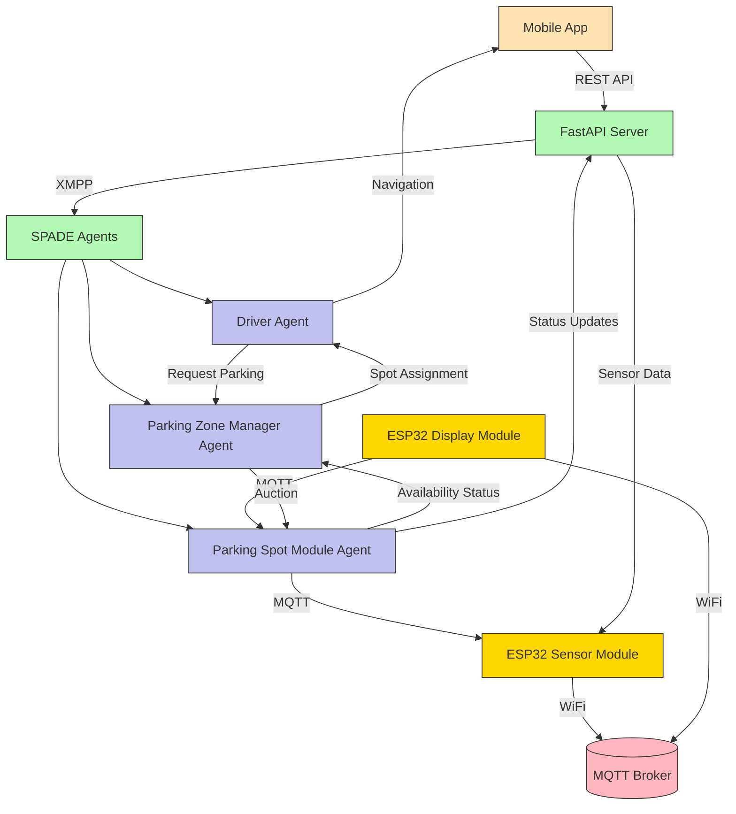

# Parking Management System using IoT and Multi-Agent Systems

## Overview

This project implements a smart parking management system using IoT devices in conjunction with an integrated multi-agent system. The system monitors parking space availability in real-time and identifies occupancy status. It's an intelligent system capable of analyzing and managing available spaces using IoT (Arduino ESP32), Multi-agent systems (SPADE), and MQTT protocol.

## System Architecture

The system is composed of three main components:

1. **IoT Layer**: ESP32 modules with ultrasonic sensors that detect vehicle presence
2. **Multi-Agent System Layer**: SPADE-based agents that manage parking spaces and coordinate auctions
3. **Mobile Application Layer**: React Native app for user interaction and navigation

## Prerequisites

### Hardware Requirements
- ESP32 modules with HC-SR04 ultrasonic sensors
- Computer/server for running the agent system
- Mobile device for the application

### Software Requirements
- Python 3.8+
- Node.js 14+
- React Native CLI
- Android Studio or Xcode for mobile development
- MQTT Broker (Mosquitto)
- Arduino IDE

## Installation

### 1. Setting up the Multi-Agent System (SPADE)

```bash
# Navigate to the SPADE directory
cd SPADE

# Install Python dependencies
pip install spade fastapi uvicorn paho-mqtt pydantic

# Run the server
python main.py
```

The server will start on `http://localhost:8000`

### 2. Setting up the ESP32 Modules

1. Open one of the template files in the `ESP32` directory:
   - `ESP32/parkingmodulescript/parkingmodulescript.ino.template` for single sensor
   - `ESP32/parkingmodulescript/double/parkingmodulescriptDouble.ino.template` for double sensors
   - `ESP32/displaymodulescript/displaymodulescript.ino.template` for display module
   - `ESP32/displaymodulescript/double/displaymodulescriptdouble.ino.template` for double displays

2. Copy the template file to remove the `.template` extension:
   ```bash
   cp parkingmodulescript.ino.template parkingmodulescript.ino
   ```

3. Install required libraries via Library Manager:
   - ArduinoJson
   - PubSubClient (for MQTT)
   - SevSeg (for 7-segment displays)

4. Update the following variables in the code with your actual values:
   ```cpp
   // WiFi credentials
   const char* ssid = "YOUR_WIFI_SSID";
   const char* password = "YOUR_WIFI_PASSWORD";
   
   // Server IP address
   const char* server_ip = "http://YOUR_SERVER_IP:8000/parking_module/ps1";
   
   // MQTT broker IP (for display modules)
   const char* mqttServer = "YOUR_MQTT_BROKER_IP";
   ```

5. Connect the HC-SR04 sensor(s) to the ESP32:
   - VCC to 5V
   - GND to GND
   - Trig to GPIO 5 (first sensor) / GPIO 27 (second sensor)
   - Echo to GPIO 18 (first sensor) / GPIO 26 (second sensor)

6. Upload the code to your ESP32 module

### 3. Setting up the Mobile Application

```bash
# Navigate to the app directory
cd parking-mobile-app

# Install dependencies
npm install

# For iOS
cd ios && pod install && cd ..
npx react-native run-ios

# For Android
npx react-native run-android
```

Before running the app, create a `config.json` file in the `parking-mobile-app` directory:

```json
{
  "ip_adress": "YOUR_SERVER_IP"
}
```

Replace `YOUR_SERVER_IP` with the IP address of the machine running the SPADE server.

## System Components

### Multi-Agent System

The system implements a three-level agent hierarchy using SPADE (Smart Python Agent Development Environment), a Python framework for developing multi-agent systems based on XMPP protocol:

1. **Driver Agent**: Represents users looking for parking spaces. This agent communicates with Parking Zone Manager Agents to request parking spots based on user preferences.
2. **Parking Zone Manager Agent**: Manages a specific parking zone and coordinates between Driver Agents and Parking Spot Module Agents. It conducts auctions among available parking spots and assigns the best match to drivers.
3. **Parking Spot Module Agent**: Represents individual parking spots and continuously monitors occupancy status through IoT sensors. These agents report real-time data to their respective Parking Zone Manager Agents.

#### Agent Communication and Coordination

The agents communicate using the XMPP protocol facilitated by SPADE framework. When a driver requests a parking spot:

1. The Driver Agent sends a request to the Parking Zone Manager Agent with preferences (price range, environment, location)
2. The Parking Zone Manager Agent initiates an auction among Parking Spot Module Agents in the zone
3. Each Parking Spot Module Agent responds with a bid based on proximity, pricing, and availability
4. The Parking Zone Manager Agent evaluates the bids and assigns the best matching spot to the driver
5. The assigned Parking Spot Module Agent confirms the reservation and provides navigation information

### FastAPI Integration

The SPADE agents are integrated with FastAPI, a modern Python web framework, to expose RESTful endpoints for system interaction:

- **Parking Management Endpoints**: Handle creation and management of parking entities (drivers, managers, zones, spots)
- **Data Ingestion Endpoints**: Receive real-time sensor data from ESP32 modules
- **Configuration Endpoints**: Allow system configuration and monitoring

FastAPI provides automatic API documentation through Swagger UI and ReDoc, making it easy to understand and test the system's capabilities.

### MQTT Communication

MQTT protocol is used for lightweight, real-time communication between IoT devices (ESP32 modules) and the system:

- ESP32 modules publish sensor data to MQTT topics
- Display modules subscribe to MQTT topics to receive parking availability information
- The SPADE system can also subscribe to MQTT topics for real-time sensor updates

### API Endpoints

The FastAPI server exposes the following REST API endpoints with automatic documentation available at `/docs`:

#### Parking Preferences
- `GET /parking_preferences` - Get available parking environments and pricing options

#### Parking Spot Modules
- `POST /parking_module/{pmodule_id}/{zone_id}` - Create a new parking spot module
- `POST /parking_module/{pmodule_id}` - Send sonar data from a parking spot
- `GET /parking_module/{pmodule_id}` - Get parking spot module information
- `PUT /parking_module/{pmodule_id}` - Update parking spot module information

#### Parking Zones
- `POST /parking_zone/{zone_id}/{manager_id}` - Create a new parking zone
- `GET /parking_zone/{zone_id}` - Get parking zone information
- `PUT /parking_zone/{zone_id}` - Update parking zone information

#### Parking Managers
- `POST /parking_manager/{manager_id}` - Create a new parking manager
- `GET /parking_manager/{manager_id}` - Get parking manager information
- `PUT /parking_manager/{manager_id}` - Update parking manager information

#### Drivers
- `POST /driver/{driver_id}` - Create a new driver
- `GET /driver/{driver_id}` - Request a parking spot for a driver
- `PUT /driver/{driver_id}` - Update driver information

#### System Status
- `GET /system_status` - Get overall system status and health information
- `GET /metrics` - Get system metrics for monitoring

### Mobile Application Features

The React Native mobile application provides a comprehensive interface for users to interact with the parking system:

1. **Interactive Map**: Shows available parking zones with real-time occupancy status
2. **Parking Search**: Allows users to search for parking spots based on location, price range, and environment preferences
3. **Spot Selection**: Displays available parking spots with detailed information including pricing, distance, and amenities
4. **Reservation System**: Enables users to reserve parking spots and receive confirmation
5. **Turn-by-Turn Navigation**: Provides GPS-based navigation to the assigned parking spot
6. **Real-time Updates**: Shows live updates on parking spot availability during navigation
7. **Payment Integration**: Calculates parking costs and processes payments automatically
8. **Parking History**: Maintains a history of previous parking sessions for user reference
9. **Notifications**: Sends alerts for reservation confirmations, upcoming expiration, and payment reminders

## Usage

### 1. Starting the System

1. Start the MQTT broker:
   ```bash
   mosquitto
   ```

2. Start the SPADE server:
   ```bash
   cd SPADE
   python main.py
   ```

3. Power on the ESP32 modules

4. Start the mobile application

### 2. Creating Agents

Before using the system, you need to create the agents:

1. Create a parking manager:
   ```bash
   curl -X POST http://localhost:8000/parking_manager/pm1
   ```

2. Create a parking zone:
   ```bash
   curl -X POST "http://localhost:8000/parking_zone/pz1/pm1?lat=41.1776&lon=-8.6077&price_hour=2.5&environment=Outdoor"
   ```

3. Create a parking spot module:
   ```bash
   curl -X POST "http://localhost:8000/parking_module/ps1/pz1" -H "Content-Type: application/json" -d '{"lat": 41.1776, "lon": -8.6077}'
   ```

4. Create a driver:
   ```bash
   curl -X POST http://localhost:8000/driver/d1
   ```

### 3. Using the Mobile App

1. Open the app and select a parking zone from the map
2. Choose your parking preferences (price and environment)
3. Confirm the assigned spot
4. Follow the directions to reach your parking spot
5. The app will detect when you've arrived using BLE

## System Architecture Diagram



## How It Works

1. **Parking Detection**: ESP32 modules with ultrasonic sensors continuously monitor parking spaces and send data via MQTT to the broker
2. **Data Processing**: FastAPI server receives sensor data and updates the system state
3. **Agent Communication**: Parking spot agents inform parking zone managers about vacancy status through XMPP protocol
4. **User Request**: Driver uses mobile app to request a parking spot with preferences
5. **Auction System**: Parking zone manager initiates an auction among available parking spots
6. **Spot Assignment**: The best matching spot is assigned to the driver based on proximity, pricing, and availability
7. **Navigation**: The mobile app guides the driver to the assigned spot using map directions
8. **Real-time Updates**: Display modules show real-time parking availability through MQTT
9. **Payment**: Parking duration and cost are calculated automatically based on arrival and departure times

## Configuration

### Environment Variables

The system supports the following environment variables for configuration:

- `MQTT_BROKER_HOST`: MQTT broker host (default: localhost)
- `MQTT_BROKER_PORT`: MQTT broker port (default: 1883)
- `SERVER_PORT`: FastAPI server port (default: 8000)
- `SPADE_HOST`: SPADE XMPP server host (default: localhost)
- `SPADE_PORT`: SPADE XMPP server port (default: 5222)
- `DATABASE_URL`: Database connection string for persistent storage
- `DEBUG`: Enable debug logging (default: False)
- `SECRET_KEY`: Secret key for JWT token generation
- `ALLOWED_ORIGINS`: Comma-separated list of allowed origins for CORS

### Available Parking Environments

The system supports multiple parking environment types to match user preferences:

- **Outdoor**: Open-air parking spaces (exposed to weather)
- **Indoor**: Covered parking spaces (protected from weather)
- **Both**: Flexible option for users who don't have a strong preference
- **Indoor-Preferred**: Preference for indoor parking when available, but willing to accept outdoor
- **Outdoor-Preferred**: Preference for outdoor parking when available, but willing to accept indoor

### Available Pricing Options

Pricing options help users filter parking spots based on their budget:

- **Low ($)**: Economical parking options (typically $1-3/hour)
- **Medium ($)**: Mid-range pricing (typically $3-6/hour)
- **High ($$)**: Premium parking locations (typically $6+/hour)

Pricing is configurable per parking zone and can be adjusted based on demand, time of day, or special events.

## Auction System and Pricing Mechanism

The parking management system implements a sophisticated auction-based allocation mechanism that ensures fair and efficient distribution of parking spots while optimizing user satisfaction and resource utilization.

### How the Auction System Works

#### 1. Agent Architecture
The system employs a three-tiered agent hierarchy:
- **Driver Agents**: Represent users seeking parking spots with specific preferences
- **Parking Zone Manager Agents**: Coordinate auctions within designated parking zones
- **Parking Spot Module Agents**: Monitor individual parking spots and participate in auctions

#### 2. Auction Process Flow

1. **Driver Request Initiation**
   - Driver Agent submits parking request with preferences:
     - Location/distance requirements
     - Price range (Low, Medium, High)
     - Environment preference (Indoor, Outdoor, Both)
     - Time constraints

2. **Zone Manager Coordination**
   - Parking Zone Manager Agent receives the request
   - Identifies all available Parking Spot Module Agents in the zone
   - Initiates distributed auction process

3. **Bid Calculation by Spot Agents**
   Each Parking Spot Module Agent calculates its bid based on:
   - **Proximity Factor**: Distance from driver's location (closer = more valuable)
   - **Pricing Model**: Hourly rate configured for the zone
   - **Availability Status**: Real-time occupancy data from sensors
   - **Demand Dynamics**: Historical usage patterns and current demand

4. **Bid Formula**
   The bid calculation follows this formula:
   ```
   Bid = (BaseValue × ProximityMultiplier) + (TimeValue × DemandFactor)
   ```
   Where:
   - **BaseValue**: Configured hourly rate for the parking zone
   - **ProximityMultiplier**: Inverse relationship to distance (0.5-1.0 scale)
   - **TimeValue**: Estimated parking duration cost
   - **DemandFactor**: Adjustment based on zone occupancy (0.8-1.2 scale)

5. **Bid Evaluation and Assignment**
   - Parking Zone Manager Agent collects all bids
   - Evaluates based on:
     - Best value proposition for driver
     - Fair pricing balance
     - Preference matching
   - Selects optimal spot and notifies driver

6. **Confirmation and Navigation**
   - Assigned Parking Spot Module Agent confirms reservation
   - Navigation data provided to driver via mobile app
   - Real-time status updates to all system components

### Dynamic Pricing Model

#### Base Pricing Configuration
Pricing is set at the parking zone level and can be adjusted based on:
- **Location Premium**: City center vs. residential areas
- **Environment Type**: Indoor spaces typically command higher rates
- **Amenities**: Covered, secure, or valet services increase value
- **Time-Based Adjustments**: Peak hours vs. off-peak pricing

#### Real-Time Price Adjustments
The system dynamically adjusts prices based on:
- **Supply and Demand**: High occupancy zones may increase prices
- **Time of Day**: Business districts more expensive during work hours
- **Special Events**: Temporary price adjustments for concerts, games, etc.
- **Seasonal Variations**: Tourist areas adjust for seasonal traffic

### Setting Up Parking Infrastructure

#### Prerequisites for System Operation
Before the auction system can function, you must configure the parking infrastructure:

1. **Create Parking Manager**
   ```bash
   curl -X POST http://localhost:8000/parking_manager/{manager_id}
   ```
   Example:
   ```bash
   curl -X POST http://localhost:8000/parking_manager/city_center_manager
   ```

2. **Create Parking Zones**
   ```bash
   curl -X POST "http://localhost:8000/parking_zone/{zone_id}/{manager_id}?lat={latitude}&lon={longitude}&price_hour={hourly_rate}&environment={environment_type}"
   ```
   Example:
   ```bash
   curl -X POST "http://localhost:8000/parking_zone/downtown_zone/city_center_manager?lat=41.1579&lon=-8.6291&price_hour=3.5&environment=Both"
   ```

3. **Create Parking Spots**
   ```bash
   curl -X POST "http://localhost:8000/parking_module/{spot_id}/{zone_id}" -H "Content-Type: application/json" -d '{"lat": {latitude}, "lon": {longitude}}'
   ```
   Example:
   ```bash
   curl -X POST "http://localhost:8000/parking_module/spot_001/downtown_zone" -H "Content-Type: application/json" -d '{"lat": 41.1579, "lon": -8.6291}'
   ```

4. **Create Driver Profile**
   ```bash
   curl -X POST http://localhost:8000/driver/{driver_id}
   ```
   Example:
   ```bash
   curl -X POST http://localhost:8000/driver/user_123
   ```

#### Complete Setup Example

```bash
# 1. Create parking manager for city center
curl -X POST http://localhost:8000/parking_manager/city_center

# 2. Create downtown parking zone (premium location)
curl -X POST "http://localhost:8000/parking_zone/downtown/city_center?lat=41.1579&lon=-8.6291&price_hour=4.0&environment=Both"

# 3. Create multiple parking spots in downtown zone
curl -X POST "http://localhost:8000/parking_module/dt_001/downtown" -H "Content-Type: application/json" -d '{"lat": 41.1579, "lon": -8.6291}'
curl -X POST "http://localhost:8000/parking_module/dt_002/downtown" -H "Content-Type: application/json" -d '{"lat": 41.1580, "lon": -8.6292}'
curl -X POST "http://localhost:8000/parking_module/dt_003/downtown" -H "Content-Type: application/json" -d '{"lat": 41.1581, "lon": -8.6293}'

# 4. Create residential parking zone (economical)
curl -X POST "http://localhost:8000/parking_zone/residential/city_center?lat=41.1600&lon=-8.6350&price_hour=1.5&environment=Outdoor"

# 5. Create spots in residential zone
curl -X POST "http://localhost:8000/parking_module/res_001/residential" -H "Content-Type: application/json" -d '{"lat": 41.1600, "lon": -8.6350}'
curl -X POST "http://localhost:8000/parking_module/res_002/residential" -H "Content-Type: application/json" -d '{"lat": 41.1601, "lon": -8.6351}'

# 6. Create driver profile
curl -X POST http://localhost:8000/driver/driver_001
```

### Testing the System

#### Prerequisites for Testing
1. **Hardware Requirements** (for real testing):
   - ESP32 modules with HC-SR04 ultrasonic sensors
   - Display modules (optional)
   - WiFi network access
   - MQTT broker (Mosquitto) running

2. **Software Requirements**:
   - Python 3.8+
   - Node.js 14+
   - MQTT broker
   - Arduino IDE (for ESP32 programming)

#### System Startup Sequence

1. **Start MQTT Broker**
   ```bash
   mosquitto
   ```

2. **Start SPADE Server**
   ```bash
   cd SPADE
   python main.py
   ```

3. **Configure and Deploy ESP32 Modules**
   - Edit ESP32 code with your WiFi credentials
   - Set MQTT broker IP address
   - Upload code to ESP32 modules
   - Power on hardware

4. **Start Mobile Application** (optional)
   ```bash
   cd parking-mobile-app
   npm start
   ```

#### Testing Without Hardware

You can test the auction system without physical hardware by simulating sensor data:

1. **Create Infrastructure** (as shown above)
2. **Simulate Sensor Data**
   ```bash
   # Send occupancy data for a parking spot
   curl -X POST "http://localhost:8000/parking_module/dt_001" -H "Content-Type: application/json" -d '{"sonar_value": 150}'
   
   # Send data for another spot
   curl -X POST "http://localhost:8000/parking_module/dt_002" -H "Content-Type: application/json" -d '{"sonar_value": 20}'
   ```

3. **Request Parking Spot**
   ```bash
   curl -X GET http://localhost:8000/driver/driver_001
   ```

#### Monitoring System Performance

The system provides comprehensive monitoring capabilities:

1. **API Documentation**: Visit `http://localhost:8000/docs` for interactive API testing
2. **System Metrics**: Access `/metrics` endpoint for Prometheus-formatted metrics
3. **Health Status**: Check `/system_status` for system health information
4. **Real-time Updates**: Monitor MQTT topics for sensor data flow

### Benefits of the Auction System

1. **Efficient Allocation**: Spots go to drivers who value them most
2. **Dynamic Pricing**: Prices adjust automatically to market conditions
3. **User Satisfaction**: Balances price and location preferences
4. **Resource Optimization**: Maximizes parking spot utilization
5. **Scalability**: Distributed agent architecture handles growth
6. **Fairness**: Transparent bidding process for all users

## Troubleshooting

### Common Issues

1. **ESP32 not connecting to WiFi**: 
   - Check SSID and password in the Arduino code
   - Verify WiFi network is accessible from ESP32 location
   - Ensure WiFi credentials don't contain special characters that need escaping

2. **Agents not communicating**: 
   - Ensure the SPADE server is running and accessible
   - Check XMPP server configuration and connectivity
   - Verify agent JID credentials are correctly configured

3. **Mobile app not connecting**: 
   - Verify the IP address in config.json
   - Ensure the FastAPI server is running and accessible from the mobile device
   - Check firewall settings on the server machine

4. **MQTT connection issues**: 
   - Check that the MQTT broker is running
   - Verify broker host and port configuration
   - Ensure network connectivity between devices and broker

5. **Database connection errors**:
   - Verify DATABASE_URL environment variable is correctly set
   - Check database server is running and accessible
   - Ensure proper database credentials and permissions

### Debugging

Enable debug logging by setting the following environment variables:

```bash
export DEBUG=1
export SPADE_DEBUG=1
export MQTT_DEBUG=1
```

For detailed agent communication logs, you can also enable XMPP protocol logging:

```bash
export XMPP_DEBUG=1
```

### System Monitoring

The system provides built-in monitoring endpoints:

- `/metrics`: Prometheus-formatted metrics for system performance
- `/system_status`: JSON response with system health information
- `/docs`: Interactive API documentation with testing capabilities

Use these endpoints to diagnose system issues and monitor performance.

## Contributing

1. Fork the repository
2. Create a feature branch
3. Commit your changes
4. Push to the branch
5. Create a pull request

## License

This project is licensed under the MIT License - see the LICENSE file for details.

## Support

<div align="center">

**Made with ❤️ by [Hugo Parreão]**

[⭐ Star this project](https://github.com/hparreao/multiagentsystem-parkingmanagement) • [🍴 Fork it](https://github.com/hparreao/multiagentsystem-parkingmanagement) • [📢 Report Issues](https://github.com/hparreao/multiagentsystem-parkingmanagement/issues)

</div>
